# Exploratory Data Analysis
Sejin Park  
2015년 7월 14일  

## Markdown Basics
http://rmarkdown.rstudio.com/authoring_basics.html

* R markdown cheat sheet  
https://www.rstudio.com/wp-content/uploads/2015/02/rmarkdown-cheatsheet.pdf

## R codechunks
http://rmarkdown.rstudio.com/authoring_rcodechunks.html

## EDA

https://github.com/genomicsclass/labs/tree/master/course1


## Histogram


```r
library(UsingR)
```

```
## Loading required package: MASS
```

```
## Warning: package 'MASS' was built under R version 3.1.3
```

```
## Loading required package: HistData
## Loading required package: Hmisc
```

```
## Warning: package 'Hmisc' was built under R version 3.1.3
```

```
## Loading required package: grid
## Loading required package: lattice
```

```
## Warning: package 'lattice' was built under R version 3.1.3
```

```
## Loading required package: survival
## Loading required package: Formula
```

```
## Warning: package 'Formula' was built under R version 3.1.3
```

```
## Loading required package: ggplot2
```

```
## Warning: package 'ggplot2' was built under R version 3.1.3
```

```
## 
## Attaching package: 'Hmisc'
## 
## The following objects are masked from 'package:base':
## 
##     format.pval, round.POSIXt, trunc.POSIXt, units
## 
## 
## Attaching package: 'UsingR'
## 
## The following object is masked from 'package:ggplot2':
## 
##     movies
## 
## The following object is masked from 'package:survival':
## 
##     cancer
```

## Galton's Data - 1
* Let's look at the data first, used by Francis Galton in 1885.
* Galton was a statistician who invented the term and concepts of regression and correlation, founded the journal Biometrika, and was the cousin of Charles Darwin.
http://www.nature.com/ejhg/journal/v17/n8/full/ejhg20095a.html

## Galton's Data - 2

  회귀(regress)의 사전적 의미는 “go back to an earlier and worse condition” (옛날 상태로 돌아감)을 의미한다. 이런 용어를 사용하게 된 것은 영국의 유전학자 Francis Galton(1822- 1911)의 연구에 기인한다. Galton은 (처음에는 sweat pea) 부모의 키와 자녀의 키 사이 관 계를 연구하면서 928명의 성인 자녀 키(여자는 키에 1.08배)와 부모 키(아버지 키와 어머 니키의평균)를 조사하여 관찰한 결과 키는 무한정 커지거나 무한정 작아지는 것이 아니라 전체 키 평균으로 돌아가려는 경향이 있다는 것을 발견하였 다. 그리하여 그가 제안한 분석 방법의 이름을 “회귀”분석이라 명명하였다.

* Reference  

http://wolfpack.hnu.ac.kr/lecture/Regression/

https://github.com/DataScienceSpecialization/courses/blob/master/07_RegressionModels/01_01_introduction/index.md


## Histogram


```r
x = father.son$fheight
round(sample(x,20),1)
```


## Histogram


```r
hist(x)
```

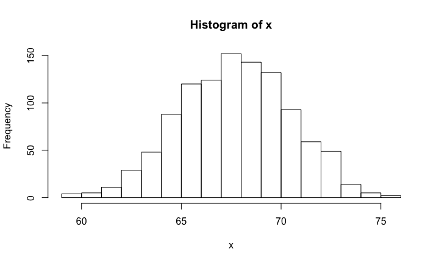 

## Histogram


```r
bins <- seq(floor(min(x)), ceiling(max(x)))
hist(x, breaks=bins, xlab="height", main = "Adult men heights")
```

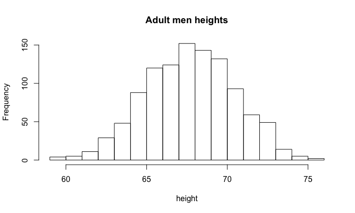 


## Empirical CDF


```r
myCDF <- ecdf(x)
xs <- seq(floor(min(x)),ceiling(max(x)),0.1)
plot(xs, myCDF(xs), type="l", xlab="Height",ylab="F(x)")
```

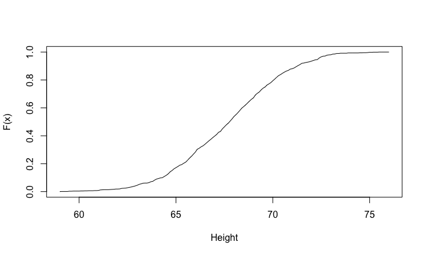 

## Normal approximation


```r
mu <- mean(x)
popsd <- function(x) sqrt(mean((x-mean(x))^2))
popsd(x)
```

```
## [1] 2.743595
```

```r
1-pnorm(72,mean(x), popsd(x))
```

```
## [1] 0.05797647
```


## QQ-plot - 1 


```r
ps <- seq(0.01,0.99,0.01)
qs <- quantile(x,ps)
normalqs <- qnorm(ps,mean(x),popsd(x))
plot(normalqs,qs,xlab="Normal percentiles",ylab="Height percentiles")
abline(0,1) ##identity line
```

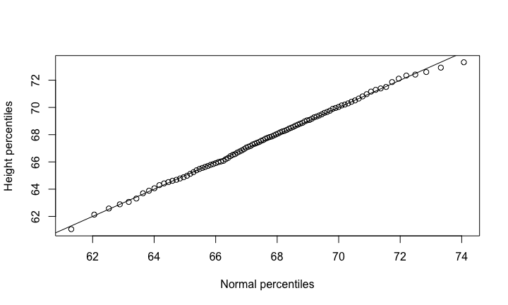 

## QQ-plot - 2

```r
qqnorm(x)
qqline(x) 
```

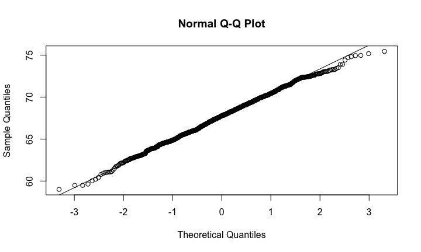 

## QQ-plot - 3

```r
n <-1000
x <- rnorm(n)
qqnorm(x)
qqline(x)
```

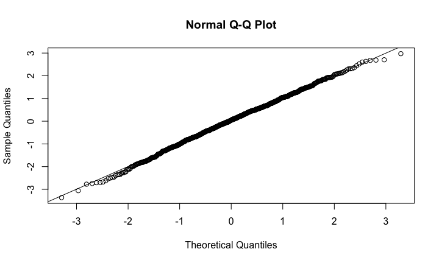 


## library(rafalib)


## QQ-plot - 4


```r
dfs <- c(3,6,12,30)
mypar2(2,2)
for(df in dfs){
  x <- rt(1000,df)
  qqnorm(x,xlab="t quantiles",main=paste0("d.f=",df),ylim=c(-6,6))
  qqline(x)
}
```

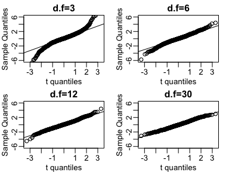 


## Boxplot - 1

```r
hist(exec.pay)
```

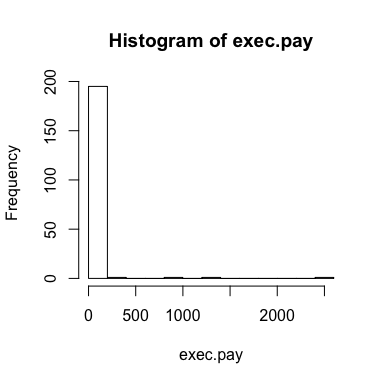 

## Boxplot - 2

```r
qqnorm(exec.pay)
qqline(exec.pay)
```

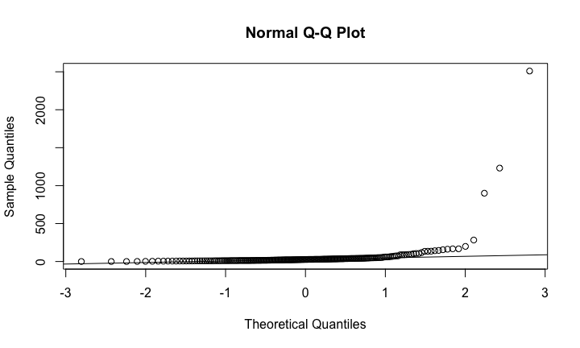 


## Boxplot - 3

```r
boxplot(exec.pay,ylab="10,000s of dollars",ylim=c(0,400))
```

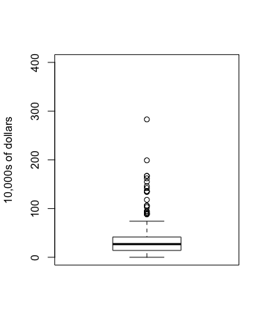 


## library(rafalib)


## Scatterplots and correlation


```r
# install.packages("UsingR")
library(UsingR)
data("father.son")
x=father.son$fheight
y=father.son$sheight
plot(x,y,xlab="Father's height in inches",ylab="Son's height in inches",main=paste("correlation =",signif(cor(x,y),2)))
```

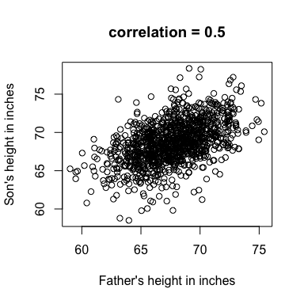 

## Stratification

```r
groups <- split(y,round(x)) 
boxplot(groups)
```

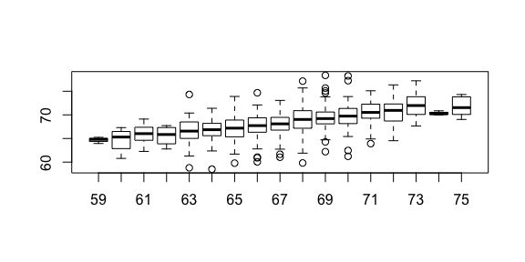 

```r
print(mean(y[ round(x) == 72]))
```

```
## [1] 70.67719
```


## Bi-variate normal distribution -1

```r
groups <- split(y,round(x)) 
mypar2(2,2)
for(i in c(5,8,11,14)){
  qqnorm(groups[[i]],main=paste0("X=",names(groups)[i]," strata"),
         ylim=range(y),xlim=c(-2.5,2.5))
  qqline(groups[[i]])
}
```

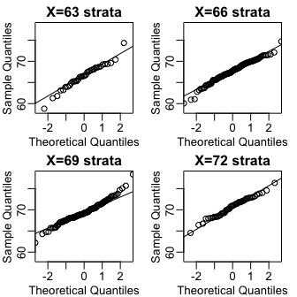 

## Bi-variate normal distribution -2

```r
x=(x-mean(x))/sd(x)
y=(y-mean(y))/sd(y)
means=tapply(y,round(x*4)/4,mean)
fatherheights=as.numeric(names(means))
mypar2(1,1)
plot(fatherheights,means,ylab="average of strata of son heights",ylim=range(fatherheights))
abline(0,cor(x,y))
```

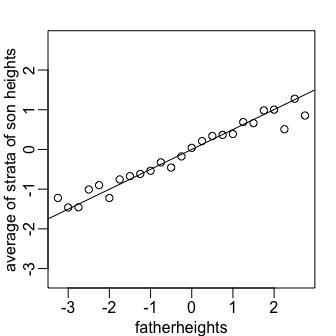 


## Spearman's correlation

```r
a=rnorm(100);a[1]=10
b=rnorm(100);b[1]=11
plot(a,b,main=paste("correlation =",signif(cor(a,b),2)))
```

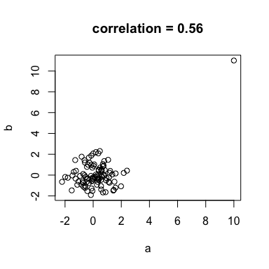 

